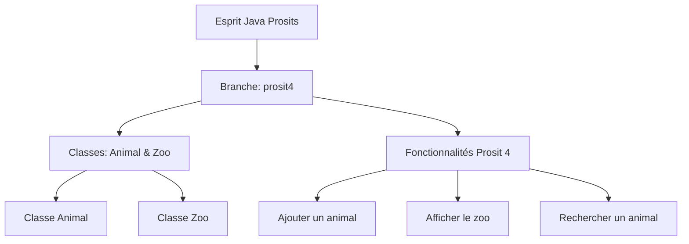

# 🦁 Esprit - Zoo Management

```mermaid
graph TD
    Root[Esprit Java Prosits] --> Prosit4[Branche: prosit4]
    
    Prosit4 --> Entities[Classes: Animal & Zoo]
    Prosit4 --> Features[Fonctionnalités Prosit 4]
    
    Entities --> Animal[Classe Animal]
    Entities --> Zoo[Classe Zoo]
    
    Features --> Add[Ajouter un animal]
    Features --> Display[Afficher le zoo]
    Features --> Search[Rechercher un animal]
```

## 📌 Navigation
Utilisez le menu déroulant des branches en haut à gauche pour consulter **prosit4**.
